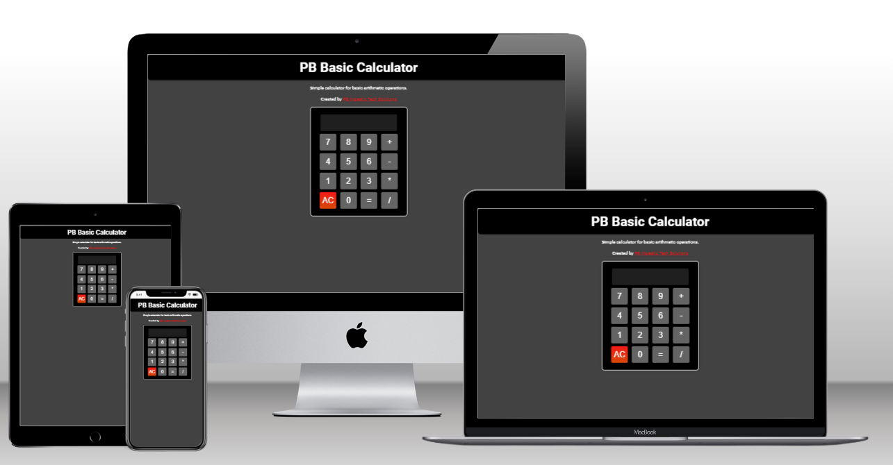
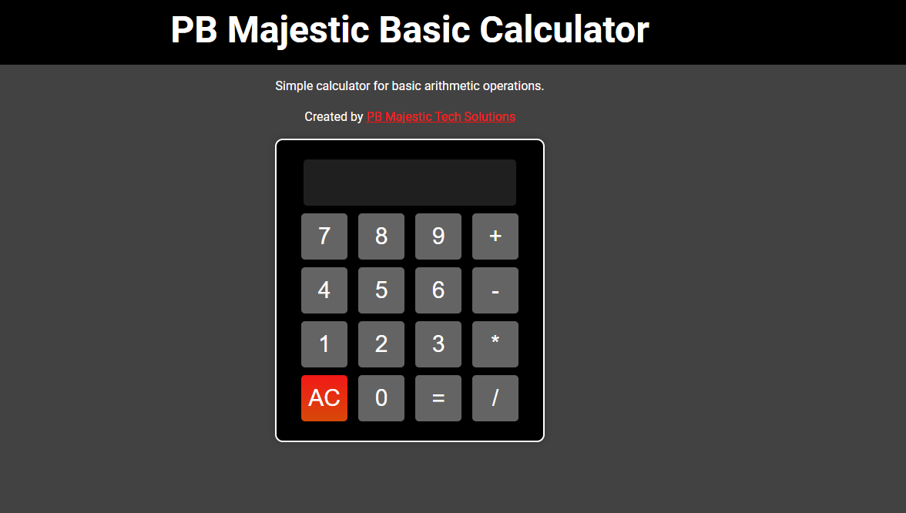
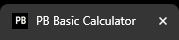
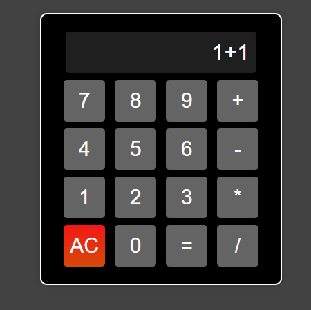
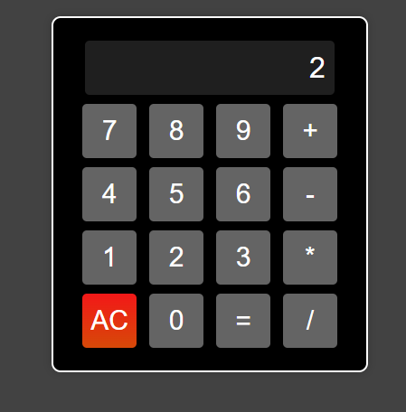
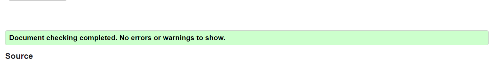
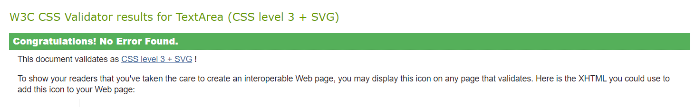
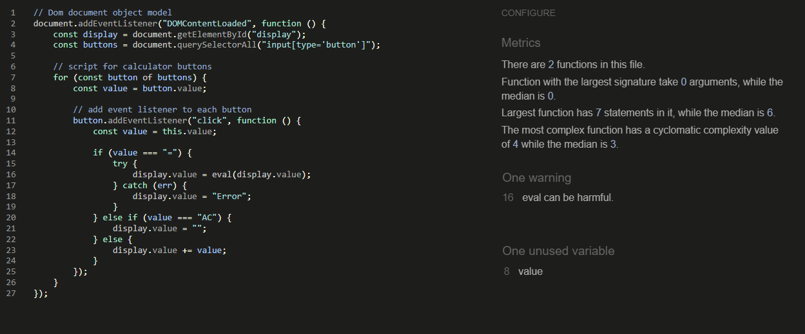
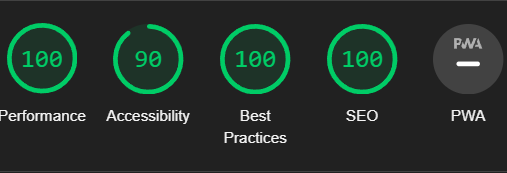

# Simple-Calculator

This is a simple calculator App made using HTML, CSS and JavaScript. It can perform basic arithmetic operations like addition, subtraction, multiplication and division. It also a clear button to clear the entire input.

View the live demo [here](https://benohene.github.io/Simple-Calculator/).

## Screenshot

## Built With

- HTML 5 - For the webpage layout
- CSS 3 - For styling the webpage
- JavaScript - For the calculator logic

## Getting Started

To get a local copy up and running follow these simple example steps.

### Prerequisites

- A web browser

### Setup

- Clone the repository on your local machine
- Navigate to the project directory
- Open the `index.html` file in your browser

## Author

👤 **Benjamin Ohene Konadu**

- Github: [@Benohene](https://github.com/Benohene)

## Features

### Home Page

The Homepage contains the calculator and a clear button to clear the entire input. It alsö has a title and a favicon.

### Favicon

The favicon is a simple calculator icon that indicates the page. It is displayed on the browser tab and has the logo of the app.

## Testing

The app was tested using the following test cases:

- 1 + 1 = 2
- 2 - 1 = 1
- 2 \* 2 = 4
- 4 / 2 = 2
- 2 + 2 \* 2 = 6
- 2 \* 2 + 2 = 6
- 2 + 2 / 2 = 3
- 2 / 2 + 2 = 3
- 2 - 2 \* 2 = -2

### Test Results

 

### HTML Validator

### CSS Validator

### JavaScript Validator

## Future Features

- Add more operations like square root, square, cube, etc.
- Add more styling to the app
- Add percentage operation
- Add a history of operations
- Add a delete button to delete the last input

## Responsive Design

The app is responsive and can be viewed on any device.

The Responsive design was tested manually with [Chrome DevTools](https://developer.chrome.com/docs/devtools/) and also the Microsoft Dev tools. The Website worked perfectly well.

The Website pass its responsiveness and no responsive issues were seen on the following trial device:

- iPhone SE
- iPhone 12 Pro
- Samsung Galaxy S20/S20 Ultra
- Surface Duo

### Lighthouse

The site was also tested using the lighthouse option built in Dev Tools in Chrome. It was used to check the following features:

- Performance - How the page performs whilst loading on the browser
- Accessibility - Is the site acccessible for all users and how can it be improved.
- Best Practices - Site conforms to industry best practices.
- SEO - Search engine optimization. Is the site optimized for search engine result rankings.

## Deployment

The site was deployed to GitHub pages. The following steps were taken:

- Create a new repository on GitHub
- Push the project files to the repository
- Navigate to the settings tab of the repository
- Scroll down to the GitHub pages section
- Select the main branch as the source
- Click save and the site will be published to GitHub pages

## Show your support

Give a ⭐️ if you like this project!

## Acknowledgments

[Google Fonts](https://fonts.google.com/) Used for fonts.

Thank you for checking out this project!
